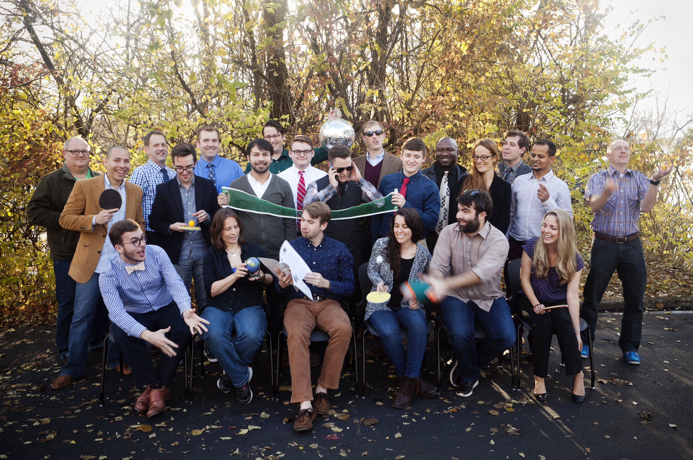

# Cohort 15 Class Website

Spin up your browser of choice and check out the website!

#### https://nss-day-cohort-15.github.io/

# About Us

Welcome from the graduates of Nashville Software School's Day Cohort 15! We've spent the last six months immersed in an intensive and cutting-edge programming curriculum and are to ready to join the ranks of Nashville's development community.

## Some of the things we've learned

### On the front-end:

- How to create dynamic SPA applications using JavaScript, JQuery, CSS3, HTML5, and the AngularJS framework
- How to leverage modern design libraries, including Bootstrap and Materialize, to build visually compelling web apps and static websites
- The importance of rich commit histories and source control
- The fundamentals of object-oriented programming and their relevance and application in modern programming
- How to manage projects by applying industry best practices using Trello and Github Projects and Issues

### Server-side:
- How to build modern ASP.NET, Web API, and CLI apps in C#/.NET
- How to write industry-standard feature tickets per the principles of behavior-driven development
- The Agile/SCRUM workflow, including daily stand-ups and regular interaction with product owners
- The fundamentals of solution design, including how to create entity relationship diagrams using draw.io
- How to use the Microsoft Entity Framework Core and ASP.NET Core Identity Framework to integrate user authentication
- How to write SQL queries and use SQLite technologies
- The principles and practice of test-driven development (TDD)

## Our instruction team:

[Joe Shepherd](https://github.com/JoeShep)  
[Scott Humphries](https://github.com/sscotth)  
[Steve Brownlee](https://github.com/stevebrownlee)  
[Brenda Long](https://github.com/brendalong)  
[Greg Korte](https://github.com/gregkorte)  
[Mathew Ostrander](https://github.com/MAOstrander)  
[Ryan Tanay](https://github.com/NewEvolution)  
[Denise Tinsley](https://github.com/dtinsley333)  
[Christina Young](https://github.com/ChristinaJYoung)  

### We can't wait to meet you!

  

